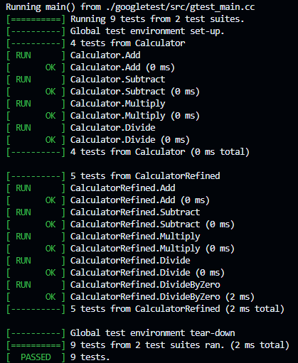

# C++ Unit Test Generator using LLM Models

This is an automated tool that generates and iteratively improves unit tests for C++ applications using a Large Language Model (LLM).

## Architecture

```
C-UNIT-TEST-GENERATOR/
├── src/                     # Sample C++ application
├── output/tests/            # Generated tests
├── prompts/                 # Instructions for LLM using YAML
├── .gitignore               # Ignores files
├── CMakeLists.txt           # Build configuration
├── generator.py             # Main generator 
└── requirements.txt         # Python requirements
```

## What this project does
- It generates initial unit tests based on a provided C++ app.
- Outputs tests in `output/tests` folder.
- Refines tests based on a follow up prompt.
- Builds and debugs the project with generated tests.

## Requirements:
- Python 3.12+
- CMake 3.16+
- Google Test Framework
- Any C++ compiler (e.g. MYSYS2)
- Any LLM Model (this one uses Ollama)

## How to get started:
1. **Install LLM**
- Install any LLM and configure it (Local or GitHub)
- Make sure its connected and running, and that your system has enough memory.

2. **Make sure CMake and Google Test are installed**
- Install CMake and Google Test (if not already installed).
- Install a C++ compiler compatible with your environment.

3. **Run the Python file**
- `python3 generator.py`
- It should start generating tests and builds.

4. **Build and run tests manually**
```bash
cd output/tests 
mkdir build
cd build
cmake .. 
make
./calculator_test
```

## Issues Faced
1. **LLM producing code in markdown format**   
Some of the consistant issues faced were:
- CodeLlama:7b Model almost always produced code in markdown format which causes the build to fail.
To combat this, I tried stripping the markdown marks from the output.

2. **Deprecation Issues with GCC 13**  
There is a deprecation bug with GNU that my project seems to trigger.  
Due to this, I wasn't able to generate test and coverage report through my python script.

## Running the build manually with CMake:
All tests passed by runnig CMake manually. 


